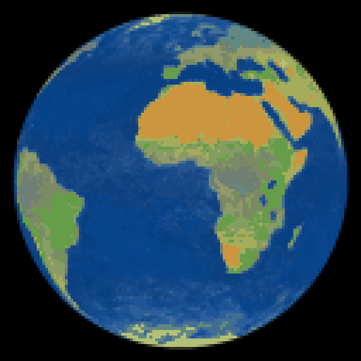

# pixel-earth

Select the Earth out of an image and crop it to a transparent PNG.

```bash
uv sync --extra dev
uv run pixel-earth                              # interactive UI, :7860
uv run pixel-earth-fetch --last 1               # mirror a day of DSCOVR/EPIC
uv run pixel-earth-batch data/epic -r           # batch a directory
uv run pytest                                   # hermetic; -m network for live
```

## Piece 1 — pixel thresholding (done)

`luminance → gaussian blur → threshold → largest blob → fill holes → erode/dilate → bbox crop`

Pure numpy + scipy, in [segment.py](src/pixel_earth/segment.py). The UI in
[app.py](src/pixel_earth/app.py) is a thin shell over it.

Otsu picks the threshold automatically. The gaussian pre-blur is the one
convolution that earns its place here: it kills sensor noise and JPEG ringing
that would otherwise speckle the mask.

Read the **mask overlay** pane, not the cutout — the overlay dims the
background and outlines the mask, so a mask that eats the limb or clips the
night side is obvious. `fill ratio` is the numeric version of the same check: a
full disc fills π/4 ≈ 0.785 of its bounding box.

### What piece 1 handles

| case | handled by |
|---|---|
| stars, moon, caption text | keep largest blob |
| dark ocean, night-side interior | fill holes |
| sensor noise, JPEG ringing | pre-blur, then erode 1–2px |
| background not pure black | Otsu, or manual threshold |

The pre-blur costs about a pixel of radius per side (it softens the limb, which
moves the Otsu cutoff). `--edge-adjust 1` buys it back if you care.

### What it does not

A terminator that runs out to the limb is an open notch, not an enclosed hole,
so hole-filling cannot recover it and the crop clips the night side. That is a
property of thresholding, not a tuning problem — see
`test_terminator_reaching_the_limb_defeats_thresholding`. Fixing it needs a
shape prior; piece 2 at least *detects* it and flags the image for review.

## Piece 2 — batch a directory (done)

```bash
uv run pixel-earth-batch <dir> [-r] [--threshold N] [--blur SIGMA]
                               [--edge-adjust PX] [--pad PX] [--min-area FRAC]
                               [--no-fill-holes] [--all-blobs] [--no-overlays]
                               [--force] [--dry-run] [-o OUT]
```

Writes into `outputs/<run_id>/` at the repo root (gitignored):

```text
outputs/<run_id>/
    manifest.json     settings, per-image stats, which images need review
    cutouts/…​.png      transparent PNGs, input tree mirrored
    overlays/…​.png     QC views
outputs/latest -> <run_id>
```

**`run_id` is a hash of the source directory plus the settings**, not a
timestamp. So:

- rerunning the same command reuses the folder and **skips finished images** —
  an interrupted batch resumes; `--force` redoes them;
- changing any setting writes a **new** folder, so two settings sit side by side
  instead of clobbering each other.

Recursion mirrors the input tree, so `a.png` and `nested/a.png` cannot collide.
EXIF rotation is applied on load. A corrupt file is recorded as `failed` and the
batch carries on.

### Reviewing a batch

`needs_review` in the manifest, and the closing CLI summary, flag every image
whose mask is not a plausible full disc. Two independent signals, because either
alone gets fooled:

| signal | catches | blind to |
|---|---|---|
| `fill_ratio` vs π/4 | mask leaked into background | clipped crescent — a 35% terminator moves it only 4% |
| `aspect_ratio` vs 1.0 | clipped disc, terminator | mask that grew symmetrically |

`min_area` (default 0.1% of frame) is the third guard: Otsu always finds
*something*, so on an empty frame it latches onto a hot pixel. Without the floor
that becomes a 3×3 "cutout"; with it, an honest `empty`.

Real check — the Meteosat full disc in [data/development/](data/development/)
comes out at `fill_ratio 0.7864` (π/4 = 0.78540) and `aspect 1.0035`, outline
sitting on the limb.

## Piece 3 — mirror DSCOVR/EPIC (done)

```bash
uv run pixel-earth-fetch --from 2024-01-01 --to 2024-12-31 --spread 3 --dry-run
uv run pixel-earth-fetch --from 2024-01-01 --to 2024-12-31 --spread 3
uv run pixel-earth-batch data/epic -r
```

DSCOVR sits at the Earth–Sun L1 point and photographs the fully lit disc all
day, so **one UTC day of frames is one full rotation** — 9 to 22 frames
depending on era, sweeping a complete 360° of longitude.

### The politeness problem

`epic.gsfc.nasa.gov` publishes **no rate limit, no API key, and a `robots.txt`
of bare `Disallow:` with no `Crawl-delay`.** Nothing upstream will ever throttle
us, so every restraint is self-imposed and untestable against the server —
which is why [tests/test_epic.py](tests/test_epic.py) spends most of its length
on exactly these guarantees:

| mechanism | default | note |
|---|---|---|
| serialised requests | `--delay 0.5` | injectable clock, so tests never sleep |
| skip existing files | on | **zero** requests — verified by a tripwire client |
| conditional GET | `--revalidate` | `If-None-Match` → `304`, no body |
| resume | automatic | `.part` + `Range:` → `206` |
| atomic writes | always | verify length, then `os.replace` |
| retry | 5 attempts, 1→16 s | honours `Retry-After`; 404 is never retried |
| byte ceiling | `--max-bytes 10GiB` | refuses up front; overshoot bounded to one file |

`--dry-run` HEADs each missing file for an exact total and writes nothing:

```text
collection natural, format png, ceiling 10.0 GiB

  2024-01-01  13 frames, 13 missing   40.0 MiB    324deg swept
  2024-07-01  21 frames, 21 missing   60.9 MiB    343deg swept
  2024-12-31  12 frames, 12 missing   37.9 MiB    323deg swept

  46 frames, 0 already present, 138.8 MiB to download
  mirror 0 B -> 138.8 MiB  (1.4% of ceiling)
```

`deg swept` sums the gaps *between* frames, so a complete day reads
`360 × (N−1) / N` — 343 for 21 frames, not 360. Well under that means the day
has a hole in its rotation.

### Mirror, not output

Downloads reproduce the archive path verbatim, kept separate from `outputs/`:

```text
data/epic/natural/2024/06/01/png/epic_1b_20240601004554.png
data/epic/natural/2024/06/01/metadata.json     ← the API response, saved
```

The mirror is the expensive-to-acquire resource; run outputs are disposable.
Re-segmenting with new settings never touches the network. This needed **no
change to `batch.py` or `segment.py`** — `pixel-earth-batch data/epic -r` just
works, and mirrors the tree into `cutouts/`.

### Gotchas the archive will not tell you about

- **Missing dates return `[]`, not 404.** Always intersect with
  `/api/<collection>/available` (3606 dates, 2015-06-13 onward, 46 KB).
- **The archive has real holes**: 230 days (2019-06-27 → 2020-02-12, DSCOVR
  safe hold), 86 days in 2025. `--spread` snaps to the nearest available date
  and prints how far it moved, so a hole is visible instead of silent.
- **The archive directory comes from the image *name*, not the `date` field.**
  On 2024-06-01 they disagree (00:45:54 vs 00:41:06); only the name matches the
  URL.
- **Metadata is `Cache-Control: no-cache, private`** with no ETag, so we cache
  it ourselves — forever for past days, one hour for today.

### Measured on 46 frames across 3 days of 2024

| | value |
|---|---|
| `fill_ratio` | 0.7805 – 0.7861 (π/4 = 0.78540) |
| `aspect_ratio` | 0.9964 – 1.0082 |
| `needs_review` | **0 of 46** |
| disc width | 1638 – 1718 px (varies with L1 distance) |
| download | 138.8 MiB, 96 requests, 2m35s |
| segmentation | 24 s for 46 × 2048² frames |

Piece 1 needed no changes for real EPIC data. Full disc, always lit, black
space — the easy case, exactly as designed for.

## Piece 4 — cloud-free rotation (done)

```bash
uv run pixel-earth-turntable data/epic --frames 72
```

A full 360° rotation, cloud-free, built entirely from frames already mirrored
locally. [catalog.py](src/pixel_earth/catalog.py) first picks every mirrored
frame that could plausibly see *any* of the `--frames` output longitudes
(metadata only, no image decoded yet — one UTC day sweeps the whole 360°, but
a given longitude is only ever lit the same way on *some* days, since
sub-satellite latitude tracks the season). [mosaic.py](src/pixel_earth/mosaic.py)
then reprojects every one of those candidates, once each, onto a single small
equirectangular `ReferenceGrid` (same orthographic projection as
[segment.py](src/pixel_earth/segment.py)'s disc, via [geometry.py](src/pixel_earth/geometry.py)),
keeping, per grid cell, the single least-cloudy candidate's whole `(R, G, B)`
— never a per-channel synthesis across frames, which is what darkened and
discoloured an earlier, unshipped attempt at this badly enough that it needed
a brightness-gain-matching patch afterwards. Every output viewpoint then just
*samples* that one grid.

That grid is a deliberate, small-scale return to something this module's
first version explicitly avoided (a persistent global raster) — because
rendering each viewpoint fully independently turned out to have a real cost:
the same physical location could flip between two different source
photographs from one rotation frame to the next whenever their cloud scores
were close, since the "least cloudy" decision was being remade from scratch
per viewpoint. Deciding it once, in a fixed lat/lon frame, removes that by
construction — two viewpoints covering the same point sample the identical
decision — and is considerably cheaper besides, since each candidate is
reprojected once total instead of once per viewpoint that happens to use it.

Cloudiness is scored by brightness × whiteness² (bright + colourless = cloud,
[cloud_score.py](src/pixel_earth/cloud_score.py)) — visible light only, so it
cannot tell cloud from snow or ice. NASA also publishes a dedicated
per-pixel cloud-fraction product; `scripts/spike_cloudfraction.py` checked
whether the *quicklook* version of it (the only part this client can reach
without a separate Earthdata login) was a usable drop-in, and found it isn't:
it's a rendered figure — title, coastline overlay, a 4-class legend — at a
different resolution, not a bare disc with a continuous per-pixel value. The
classification underneath it visibly tracks real cloud structure, so it's a
plausible future upgrade; wiring it in would mean detecting and cropping the
disc out of that chrome first, which is real scope beyond "swap the score
function," so it's parked as a documented no-go for now
(`cloud_score.cloudfraction_score`).

### Measured on the full 1014-frame, 63-day mirror, `--frames 72 --radius 360`

| | value |
|---|---|
| `mean_suspect_fraction` (no trustworthy pixel found) | ~0.0005% |
| `reference_candidate_count` (unique frames composited into the grid) | 620 |
| `reference_coverage` (fraction of the grid with any data) | 97.9% |
| total render time, all 72 frames | ~1m50s |

`suspect_fraction` per frame and the reference-grid stats above are all in
`manifest.json` — deliberately not hidden or covered up, since coverage is
naturally thinner at longitudes only ever photographed far from the
equinoxes.

### What it does not do

Thin or broken cloud that isn't bright-and-white (haze, low stratus — the
Pacific is the visible example) can score as merely "less clear" rather than
"cloud," so the least-cloudy real candidate sometimes still shows soft, muted
texture there instead of a crisp cutout. Blending across more near-tied
candidates (`--blend-k`) doesn't fix this — it's a scoring blind spot, not a
selection one — so it's the same class of known limitation as snow/ice.

## Piece 5 — pixel art (done)

```bash
uv run pixel-earth-pixelart outputs/<turntable-run-id> --sizes 16,32,64,128
```

Takes a turntable run's RGBA frames and, per requested size, runs each
through [pixelart.py](src/pixel_earth/pixelart.py)'s pipeline: `grade` (colour
towards a punchier "expected Earth" look — see below), `downsample_rgba`
(shrink to the working grid), quantize to a small fixed palette, then
`upscale_nearest` back up for viewing. [sprites.py](src/pixel_earth/sprites.py)
is the CLI/orchestration layer, following the same hashed-run-folder
convention as [turntable.py](src/pixel_earth/turntable.py).

**Colour grading** (`grade`) is a `--stylize` knob from 0 (the true, muted
colour DSCOVR actually saw) to 1 (fully graded), built from three
per-pixel-only operations — a gamma brightness lift (real EPIC frames are
*dark*, median brightness ~0.3, not washed-out-grey), a post-lift contrast
curve, and a saturation *vibrance* curve. None of it depends on where a pixel
sits in the image, so it can't mistint a specific feature. On top of that,
`land_green` rotates tan/brown land hues (true land clusters at 20-50°,
essentially no green in the raw data) toward green by up to 90°, weighted
down by brightness — real deserts are dramatically brighter than vegetation,
so bright land mostly keeps its true tan while darker land goes green. Ask
for less green with `--land-green`, less pop with `--stylize`,
`--saturation-boost`, `--gamma`, `--contrast`.

**Downsampling** defaults to nearest-neighbour (`--downsample nearest`) — one
source pixel per output cell, no averaging, so region boundaries land as one
hard step rather than a soft gradient. That boldness has a cost across a
*sequence*: a single sample per cell aliases at hard edges (coastlines) as
the viewpoint rotates by fractions of a pixel between frames, visible as
flicker even when the underlying colour is perfectly stable.
`--supersample N` (default 8) takes N×N nearest-neighbour samples per output
cell and averages just those — interior cells are still one flat colour (all
N² samples agree), but a cell straddling a boundary blends smoothly instead
of aliasing between two extremes.

**Palette**: `--shared-palette` (on by default) discovers one palette from
every frame in the sequence combined, and quantizes each frame against that
same palette — the fix for a second, independent kind of flicker: two frames
showing different parts of the globe otherwise discover slightly different
optimal palettes, so an unchanged true colour can snap to a different swatch
frame to frame.

### Temporal consistency

The reference-grid rework in Piece 4 and the shared palette here exist for
the same reason: a rotation is only as good as its *worst* frame-to-frame
jump. Verified directly — sampling a single physical point (5°N, 20°E)
across ten adjacent rotation frames of the pixel-art output — its colour is
`(123, 138, 105)` in every one of them, exactly. Some smaller residual
variation (mostly tens of RGB units, at points sitting directly on a
coastline) remains and is expected: it's genuine sub-pixel aliasing of a hard
edge in a low-resolution rotating render, not a data or logic bug, and
`--supersample` is the lever for trading render time against how much of it
gets smoothed away.

### Known-good preset — `pixelart-15ae4b74`



The settings behind a run the author was particularly happy with, recorded
here so they don't get lost to a future default change (full settings are
also in that run's own `manifest.json`, alongside its source turntable run's):

```bash
uv run pixel-earth-turntable data/epic --frames 72 --radius 360
# -> outputs/58c4e1f6 (620 reference candidates, 97.9% coverage, ~1m50s)

uv run pixel-earth-pixelart outputs/58c4e1f6 --sizes 16,32,64,128
# -> outputs/pixelart-15ae4b74
```

At the time of this run, every value above was simply the shipped default —
`stylize=1.0, saturation_boost=1.8, gamma=2.4, contrast=0.35, black_point=0.05,
land_green=1.0, colors=32, dither=false, downsample_method=nearest,
supersample=8, shared_palette=true`. If defaults ever drift, this preset
still reproduces exactly by pinning those values explicitly on the command
line.

### Pushed preset — `pixelart-cf6abfd1`


Same source rotation (`outputs/58c4e1f6`), turned up for a bolder, more
saturated "retro game map" look:

```bash
uv run pixel-earth-pixelart outputs/58c4e1f6 --sizes 16,32,64,128 \
  --saturation-boost 2.5 --gamma 2.6 --contrast 0.5 --colors 24
# -> outputs/pixelart-cf6abfd1
```

Full settings: `stylize=1.0, saturation_boost=2.5, gamma=2.6, contrast=0.5,
black_point=0.05, land_green=1.0, colors=24, dither=false,
downsample_method=nearest, supersample=8, shared_palette=true` — every value
not listed on the command line above is still the shipped default.

Getting here overshot once: an earlier attempt also dropped `--colors` to 16,
which merged the Sahara and the savanna belt below it into the same washed
yellow-green swatch — less interesting, not more. Fewer colours isn't
automatically "more pixel art"; `colors=24` was the point where cutting the
palette stopped helping and started erasing real distinctions the higher
saturation/contrast had just made sharper.

## Next pieces

7. **Click to select** — `gr.Image.select` gives the click point for free; use
   it to seed a flood fill, or to pick among candidate blobs.
8. **GrabCut** — for when the Earth is not a disc (a map, a globe on a desk).
9. **SAM** — click-to-mask, best quality, ~350MB of torch.

**Hough circle**, previously piece 3, is deferred indefinitely. It was the fix
for a clipped terminator, and DSCOVR never produces one.
